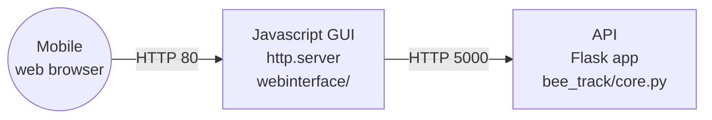

# bee_track
Tracking software to run on pi

# Getting the pi set up

To make it possible to ssh into, use:

"For headless setup, SSH can be enabled by placing a file named ssh, without any extension, onto the boot partition of the SD card from another computer." -- https://www.raspberrypi.org/documentation/remote-access/ssh/

Edit `/etc/wpa_supplicant/wpa_supplicant.conf`, enter:

    ctrl_interface=DIR=/var/run/wpa_supplicant GROUP=netdev
    update_config=1
    
    network={
        ssid="SSID"
        psk="PASSWORD"
    }
    
    network={
        ssid="SSID"
        psk="PASSWORD"
    }

# Installation

Download the aravis library:

    git clone https://github.com/AravisProject/aravis.git

Or donwload earlier version from
http://ftp.gnome.org/pub/GNOME/sources/aravis/0.6/

then if you need the viewer (although I did find I had to split these installs).

    sudo apt install libgtk-3-dev libnotify-dev libgstreamer1.0 libgstreamer-plugins-base1.0-dev gstreamer1.0-plugins-bad

other stuff...

    sudo apt-get install gnome-common intltool valac libglib2.0-dev gobject-introspection libgirepository1.0-dev libgtk-3-dev libgnome-desktop-3-dev libcanberra-dev libgdata-dev libdbus-glib-1-dev libgstreamer1.0-dev libupower-glib-dev libxml2-dev

for a while now aravis has used meson for building...

    sudo pip3 install ninja meson
    
    cd aravis
    meson build
    cd build
    meson configure -Dviewer=enabled -Dintrospection=enabled -Dgst-plugin=enabled
    ninja
    sudo ninja install
    cd .. #to aravis
    sudo ldconfig

(maybe see https://github.com/sightmachine/SimpleCV/wiki/Aravis-(Basler)-GigE-Camera-Install-Guide)

Download this tool

    pip install git+https://github.com/lionfish0/bee_track.git

In /etc/rc.local add line:

    su - pi -c /home/pi/bee_track/startup &

Also to make numpy work:

    sudo apt install libatlas3-base
    sudo pip3 install numpy

Also:

    pip3 install scipy
    git clone https://github.com/lionfish0/retrodetect.git
    cd retrodetect
    pip3 install -e .
    git clone https://github.com/lionfish0/QueueBuffer.git
    cd QueueBuffer
    pip3 install -e .
    pip3 install libsvm
    pip3 install -U flask-cors
    pip3 install mem_top
    pip3 install flask_compress

# Architecture

